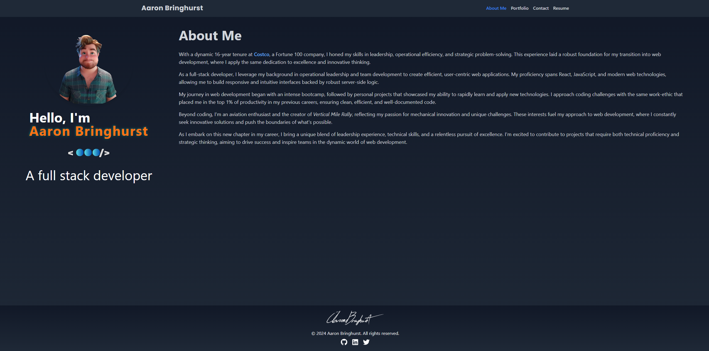

# YourPortfolioName: React Portfolio

## Description
**YourPortfolioName** is a dynamic, responsive web portfolio built using React and styled with Tailwind. It showcases my skills, projects, and professional information in an interactive and visually appealing manner. This portfolio is designed to highlight my capabilities as a Full-Stack Web Developer and provide potential employers or clients with a comprehensive overview of my work.

## Table of Contents
1. [Screenshot](#screenshot)
2. [Usage](#usage)
3. [Features](#features)
4. [Technologies Used](#technologies-used)
5. [Deployment](#deployment)
6. [Contributing](#contributing)
7. [License](#license)
8. [Questions](#questions)

## Screenshot

## Usage
To view the portfolio, simply visit the deployed application URL. Navigate through different sections using the menu in the header. Click on project links to view deployed applications or GitHub repositories.

## Features
- **Responsive design** that works on desktop and mobile devices
- **About Me** section with a brief bio
- **Portfolio** section showcasing recent projects with links to deployed applications and GitHub repositories
- **Contact form** for easy communication
- **Downloadable resume** and list of proficiencies

## Technologies Used
-  [React.js](https://reactjs.org/)
-  [Vite](https://vitejs.dev/)
-  [Tailwind CSS](https://tailwindcss.com/)
-  [React Router](https://reactrouter.com/)
-  [Netlify](https://www.netlify.com/)

## Deployment
The portfolio is deployed using Netlifty. You can view the live application [here]https://serene-truffle-babcd5.netlify.app/

## Contributing
Contributions to this project are not currently accepted. This is a personal project and serves as a showcase of my skills.

## License
This project is licensed under the MIT License. See the [LICENSE](LICENSE) file for details.

## Questions
If you have any questions you can reach me at my [Email](bringhurst.aaron@gmail.com). You can find more of my work on my Github page [Aaron Bringhurst](https://github.com/AaronBringhurst).
